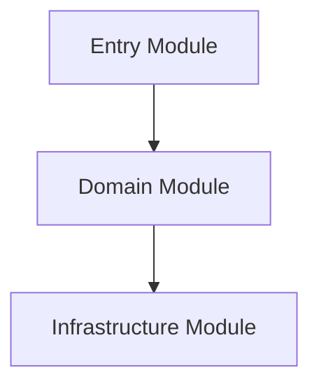

# C4 Code View

This document provides a code-level decomposition for the most critical module or execution path.

Use this view sparingly to document stable code boundaries that matter for maintenance, not transient implementation details.

---
Maintainer/Author: <MAINTAINER_AUTHOR>
Version: 0.1.0
Last modified: 2026-03-01
---
