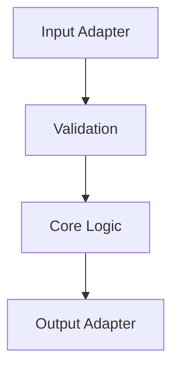

# C4 Component Runtime View

This document shows the major runtime components inside the main application container.

Use this view to capture internal responsibilities, sequencing constraints, and component boundaries within the runtime.

---
Maintainer/Author: <MAINTAINER_AUTHOR>
Version: 0.1.0
Last modified: 2026-03-01
---
