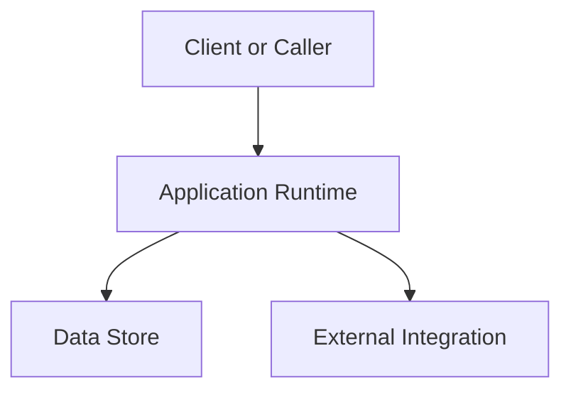

# C4 Container View

This document shows the main runtime containers that make up the system.

Use this view to document the major deployable units, their responsibilities, and the allowed communication paths.

---
Maintainer/Author: <MAINTAINER_AUTHOR>
Version: 0.1.0
Last modified: 2026-03-01
---
