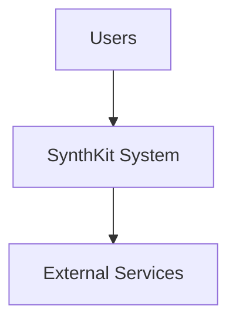

# C4 Context View

This document shows the system in relation to its users and external dependencies.

Use this view to name the primary actors, identify external systems, and clarify the boundary of responsibility.

---
Maintainer/Author: <MAINTAINER_AUTHOR>
Version: 0.1.0
Last modified: 2026-03-01
---
